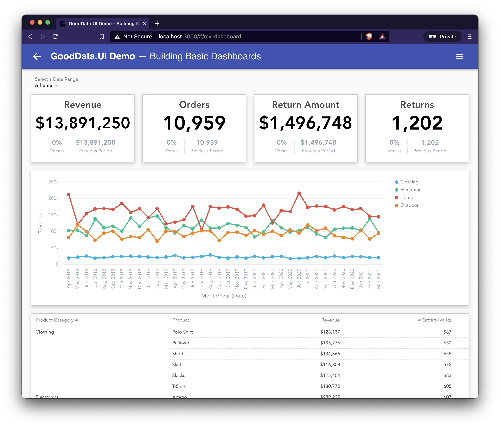
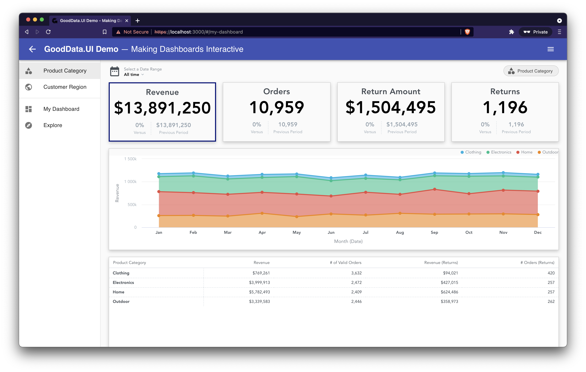

# GoodData.UI Dashboard Demo

This repository contains a source code for the [GoodData University](https://university.gooddata.com/) courses:

* **Building Basic Dashboards**
  * Course: https://university.gooddata.com/gdui-demo-building-basic-dashboards
  * Source: [tutorial-2/my-dashboard-app folder](tutorial-2/my-dashboard-app)
  * Live demo: http://use.gd/gooddata-ui-demo-tutorial-2

* **Making Dashboards Interactive**
  * Course: https://university.gooddata.com/gdui-demo-making-dashboards-interactive
  * Source: [tutorial-3/my-dashboard-app](tutorial-3/my-dashboard-app)
  * Live demo: http://use.gd/gooddata-ui-demo-tutorial-3

* **Building Custom Visualizations**
  * Course: https://university.gooddata.com/gdui-demo-building-custom-visualizations
  * Source: [tutorial-4/my-dashboard-app](tutorial-4/my-dashboard-app)
  * Live demo: http://use.gd/gooddata-ui-demo-tutorial-4

## How To Run Locally

1. `git clone https://github.com/gooddata/gooddata-ui-demo.git`
1. `cd gooddata-ui-demo/tutorial-2/my-dashboard-app/` # or tutorial-3, or tutorial-4
1. `yarn install`
1. `yarn start`

## Screnshots

